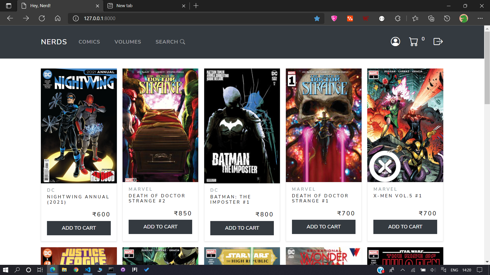

<!-- Nerds.com - An E-commerce web site to buy commics. -->


<!-- PROJECT LOGO -->
<div align="center">
<div id="top"></div>
<h3 align="center">Nerds.com - An E-commerce web site to buy comic books.</h3>
</div>
<br />


<!-- TABLE OF CONTENTS -->
<details>
  <summary>Table of Contents</summary>
  <ol>
    <li>
      <a href="#built-with">Built With</a>
    </li>
    <li>
      <a href="#prerequisites">Prerequisites</a>
    </li>
    <li><a href="#usage">Usage</a></li>
    <li><a href="#acknowledgments">Acknowledgments</a></li>
    <!-- <li><a href="#license">License</a></li> -->
  </ol>
</details>
<br />




<!-- ABOUT THE PROJECT -->
<div id="built-with">

### Built With

* [Django](https://www.djangoproject.com/)
* [SQLite](https://www.sqlite.org/index.html)
* [Bootstrap](https://getbootstrap.com)
* [JQuery](https://jquery.com)

<p align="right">(<a href="#top">back to top</a>)</p>

</div>


<!-- GETTING STARTED -->
<div id="prerequisites">

### Prerequisites

<!-- * Python >= 3.5 is preferd. -->

* Run following command to install all required package dependencies.

  ```sh
  pip install -r requirements.txt
  ```

* Setup following environment variables in your system.

  * DJANGO_SECRET_KEY = Django project Secret key
  * DJANGO_EMAIL_HOST_USER = Your Host email id
  * DJANGO_EMAIL_HOST_PASSWORD = Your Host email password
  * RAZORPAY_ID = Your Razorpay id
  * RAZORPAY_SECRET_KEY = Your Razorpay Secret key

<p align="right">(<a href="#top">back to top</a>)</p>

</div>


<!-- USAGE EXAMPLES -->
<div id="usage">

## Usage

Some screenshots from my project, soon going to share a demo youtube video link.

| | |
|:-------------------------:|:-------------------------:|
|  Main view 1 |  Main view 2 |
|  Detail view 1 |  Detail view 2 |
|  Comic book search/filter |  Volume search/filter|
|  Cart |  Checkout |
|  Payment |  After payment|
|  Home/User/Personal data |  Address |
|  All orders |  Wishlist |

<p align="right">(<a href="#top">back to top</a>)</p>

</div>


<!-- ACKNOWLEDGMENTS -->
<div id="acknowledgments">

## Acknowledgments

This is list of resources i find helpful and would like to give credit to.

* [ Django documentation ](https://docs.djangoproject.com/en/3.2/)
* [ bootswatch.com - Free Bootstrap theme ](https://bootswatch.com/)
* [ StackOverflow - The G.O.A.T](https://stackoverflow.com/)

<p align="right">(<a href="#top">back to top</a>)</p>

</div>


<!-- LICENSE -->
<!-- <div id="license">

## License

Distributed under the MIT License. See `LICENSE.txt` for more information.

<p align="right">(<a href="#top">back to top</a>)</p>

</div> -->
